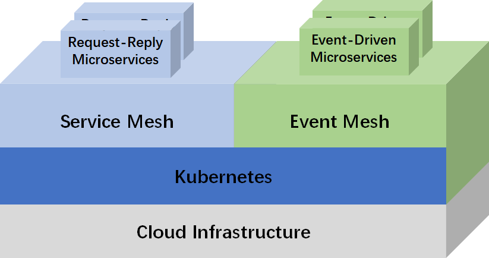
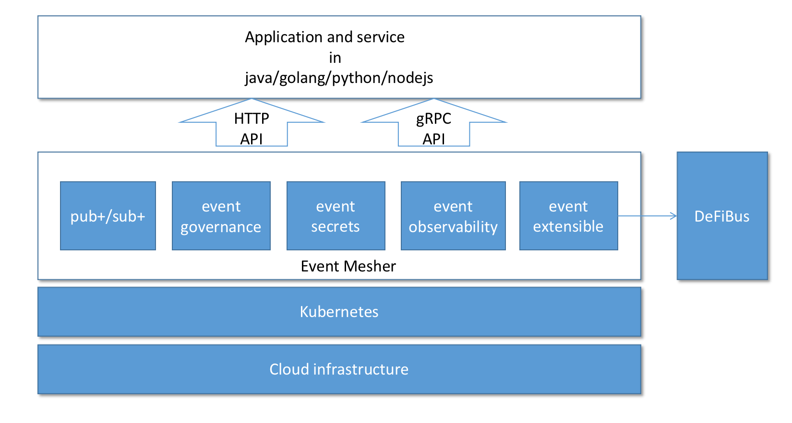
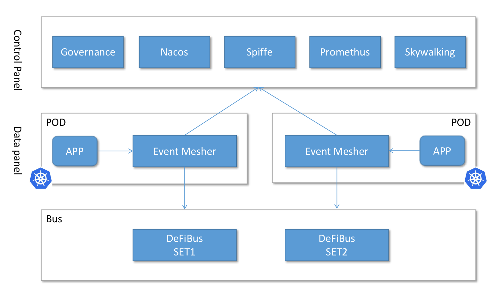

[点我查看中文版](README.zh-CN.md)

## What is Event Mesh?
This figure shows the positioning of the event mesh relative to other similar technologies (such as service mesh) in the application framework.

Event Mesh is a dynamic plug-in cloud-native basic service layer used to decouple the application and middleware layer. It provides flexible, reliable and fast event distribution, and can be managed.

Cloud Native Event Mesh:

The event mesh allows events from one application to be dynamically routed to any other application.
General functions of the event mesh:
* Event driven;
* Event governance;
* Dynamic routing;
* Cloud native

Dependent components:
* DeFiBus : a distributed messaging platform with low latency, high performance and reliability, flexible scalability. [DeFiBus](https://github.com/WeBankFinTech/DeFiBus)
* RocketMQ

Key components:
* eventmesh-emesher : an middleware to transmit events between event producers and consumers, support cloud native apps and microservices
* eventmesh-sdk-java : currently supports HTTP and TCP protocols, and will support gRPC in the future
* eventmesh-registry : automatically routes events between applications and services connected to seperate event meshers, manage eventmesh-emesher

## RoadMap
| version | feature |
| ----    | ----    |
| v1.0.0  |Support DeFiBus as eventstore, support pub/sub, http api, java-sdk|
| v1.1.0  |Support rocketmq as eventstore|
| v1.1.1  |Support https|
| v1.2.0  |Support transaction event|
| v1.3.0  |Support Plug-in architectur|
|         |Support Event Sourcing|
|         |Support Event orchestration|
|         |Support Dashboard|
|         |Support Event governance|
|         |Support Nacos as an event router|
|         |Support Promethus|
|         |Support Skywalking|
|         |Support Spiffe|
|         |Support gRPC|
|         |Support c/go/python/nodejs SDK|

## Quick Start
1. Build and deploy event-store([DeFiBus](https://github.com/WeBankFinTech/DeFiBus)), 
   see instruction ['event-store quickstart'](docs/en/instructions/eventmesh-store-quickstart.md).
2. Build and deploy eventmesh-emesher, see instruction ['eventmesh-emesher quickstart'](docs/en/instructions/eventmesh-emesher-quickstart.md).
3. Run eventmesh-sdk-java demo, see instruction ['eventmesh-sdk-java quickstart'](docs/en/instructions/eventmesh-sdk-java-quickstart.md). 

## Contributing
Contributions are always welcomed! Please see [CONTRIBUTING](CONTRIBUTING.md) for detailed guidelines

You can start with the issues labeled with good first issue. 
[GitHub Issues](https://github.com/WeBankFinTech/EventMesh/issues)

## License
[Apache License, Version 2.0](http://www.apache.org/licenses/LICENSE-2.0.html) Copyright (C) Apache Software Foundation

## Contacts
WeChat group：

